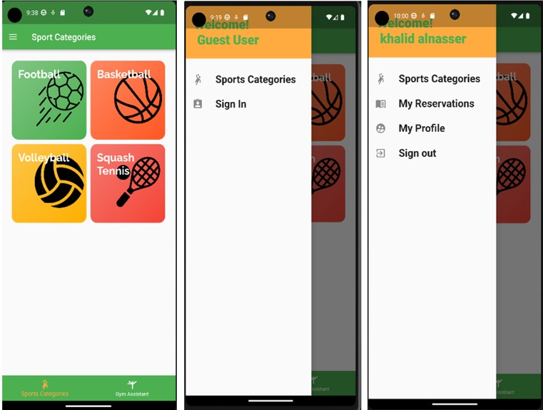
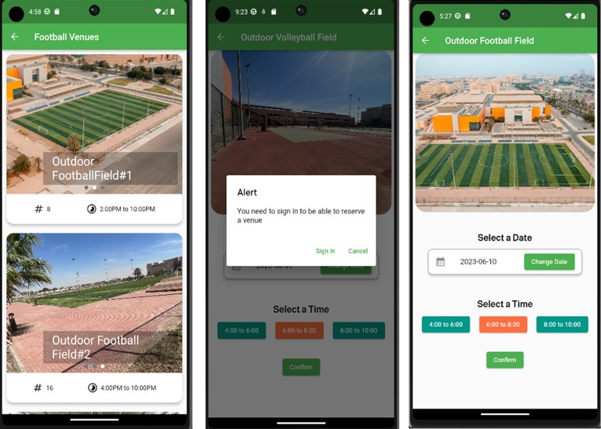
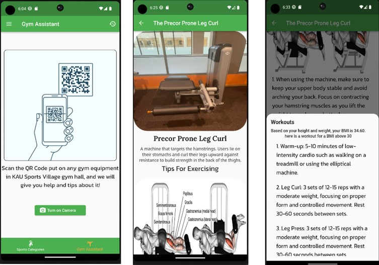

# kau_sports_village_project

This project is for CPIT-499 senior project. The repositiry conatins the KAU Sports Village mobile app, which helps the beneficiers of the sports facility in the university to check and reserve sports venues online through the app and manage their reservations. It also helps the users in their excersices inside the gym by providing custom tips and workouts based on their health profile. The app is developed using the Flutter framework.

-------------

-------------

